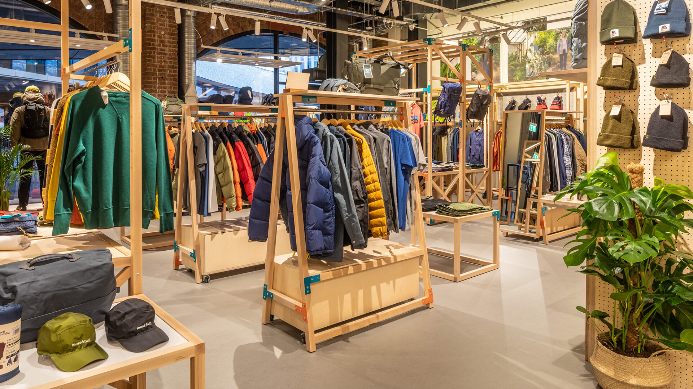
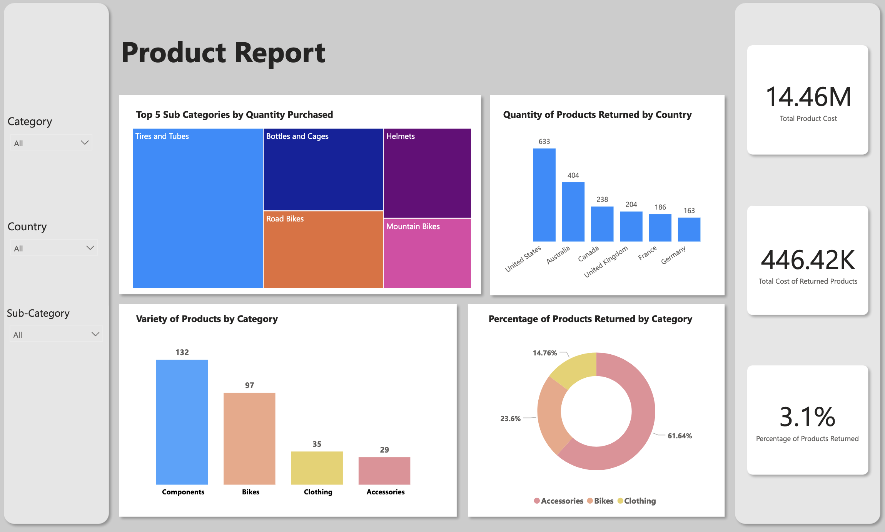
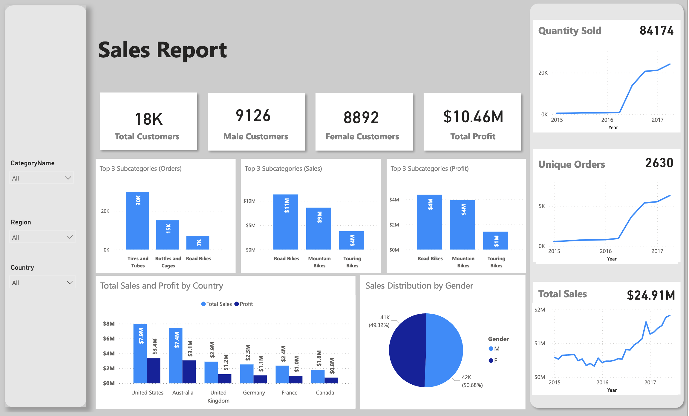
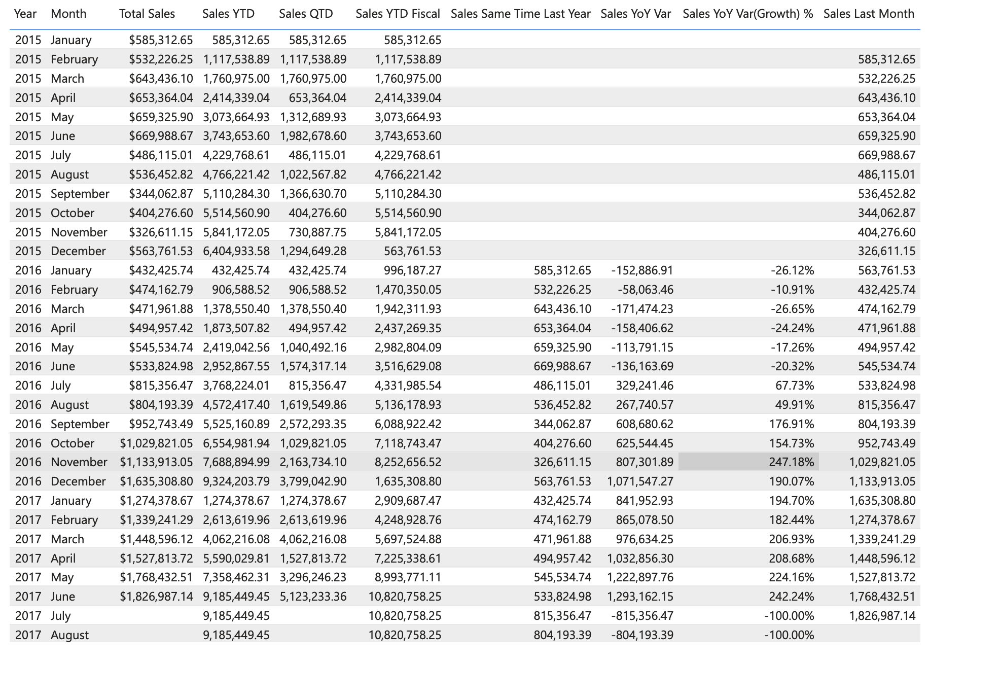

# Adventureworks Store Sales and Products Report

 

## Introduction
This a power Bi project on sales and product analysis on an imaginary store called “Adventureworks”. This project seeks to analyze and gain insights to answer crucial questions to help the store make data driven decisions.

__Disclaimer__: All datasets and reports do not represent any company, institution or country, but just a dummy dataset to demonstrate the potential of power Bi.

## Skills/Concepts demonstrated
The following power Bi features were incorporated – __Dax__ , __Modelling__,  __Quick measures__ and __Time intelligence__

## Problem Statement
* What was the total cost incurred by the company due to products being returned.
* What was the total worth of products available
* What was the total profit in the three years

## Modelling
Automatically derived relationships were modified to only include those that were relevant to our analysis. The data model that was used was the star schema data model

## Data Source
Our data source was from imharshilpatel’s  GitHub the link is  [Data Source](https://github.com/imharshilpatel/Adventure_Works)

## Data Transformation 
Data was validated and was confirmed to be clean so most of the data transformation involved the modification of names and columns as shown below
* Changed the “SalesTerritoryKey” column in the Territory table to “Territory Key” 
* Removed irrelevant columns in the Product table
* Filtered rows to remove  “NA” in the gender field since it meant they no gender was selected
* Appended the separate sales tables for the years 2015,2016,2017 into one sales table.

## Visualization and Insights
### Product

 

__Insights__
* We are able to see that the percentage of products returned after purchase was __3.1%__. which means there was a high satisfaction the products.
* We could see that most of the products returned were accessories __61.64%__. USA had the highest quantity of returned products __633__ and Germany has the least quantity of returned products __163__
*  The company’s inventory was mainly made up of Components and Bikes __78%__.
*  The total cost of returned products was __$446,000.42__
*  Total worth of products is __$14.46 million__

### Sales

__Insights__
*	There was an even distribution of male and female customers. With the amount of sales made by each segment being similar. This means that the products offered appealed to both genders equally.
*	The bikes category brought in the most sales with the top 3 sub-categories all coming from the bikes category. These top 3 sub categories made up more than 80% of total sales
*	Tires and tubes were the most bought sub-category (30k Orders)
*	Road bikes performed the highest when it came to Sales($11m) and Profits(4m).
*	Total Profit was $10.46 million

### Time intelligence (Sales)
This enabled us to get an idea of sales performance over the various years

## Conclusion and Recommendation
* The percentage of products being returned being 3.1% showed massive satisfaction with our products.
* The accessories category made up more than half of the products returned. Further investigations are needed to find out the cost. E-mails can be sent to customers who return goods allowing them to state the reasons for the return. 
* The variety of products under the Clothing and Accessories category was the least. It recommended to get more varieties under these categories to give customers more options. This can cause an increase in purchases for these categories
* Bikes made up more than 80% of purchases with other categories performing poorly compared to bikes. I will suggest that bikes can be sold with other products as packages and these packages offered at a discount to increase purchases.

